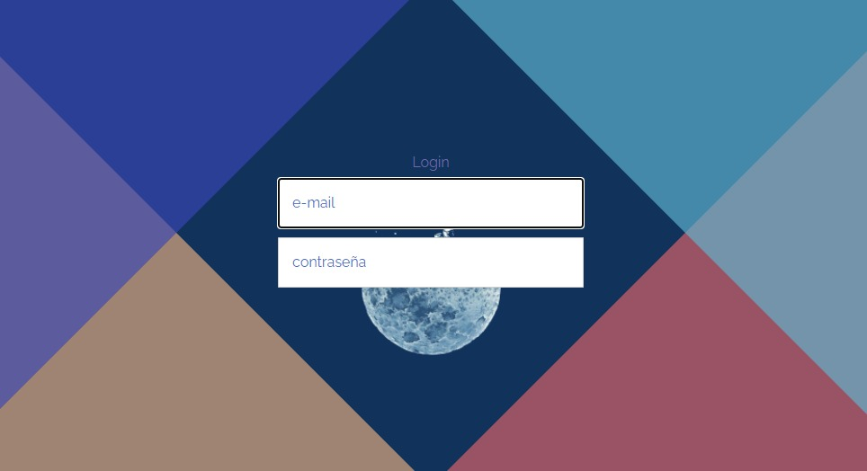
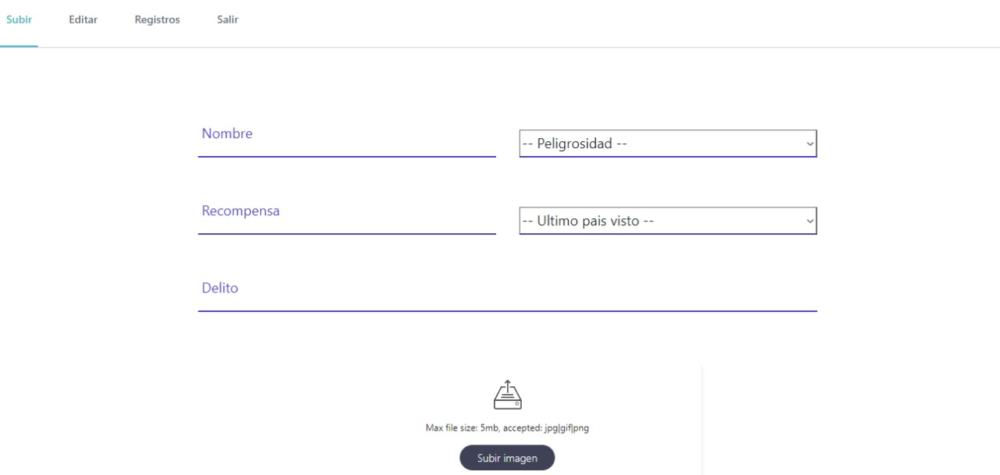
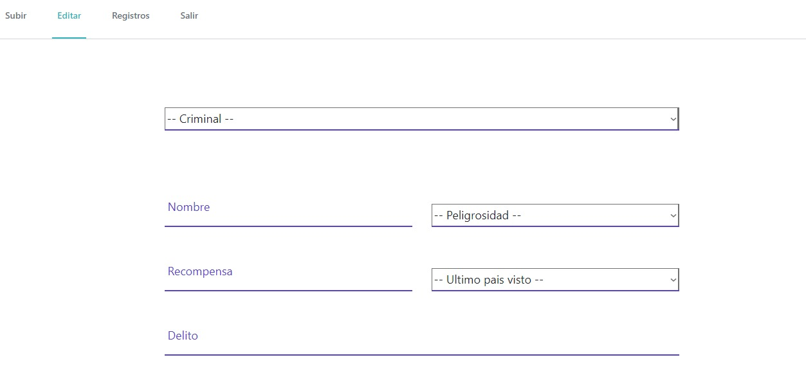
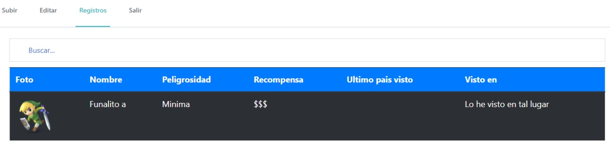
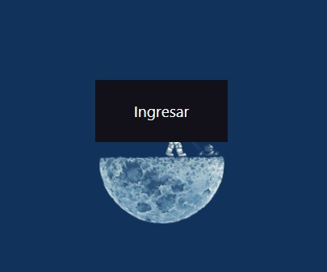
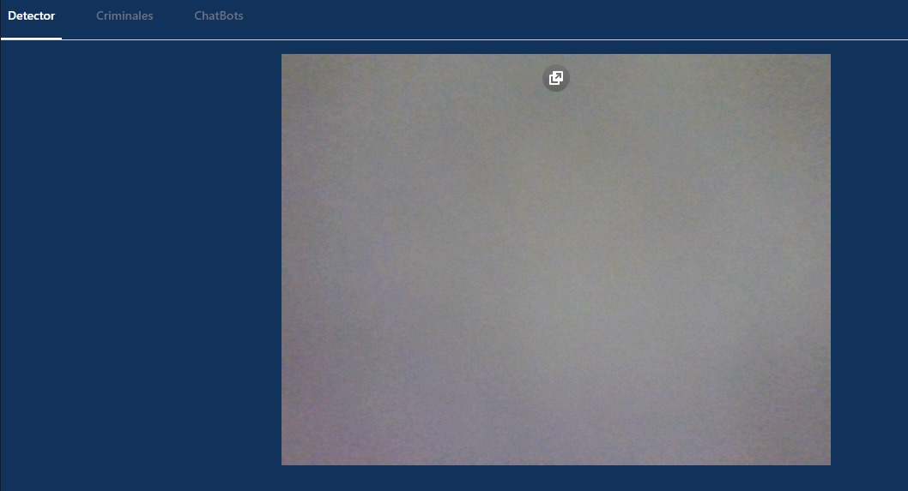
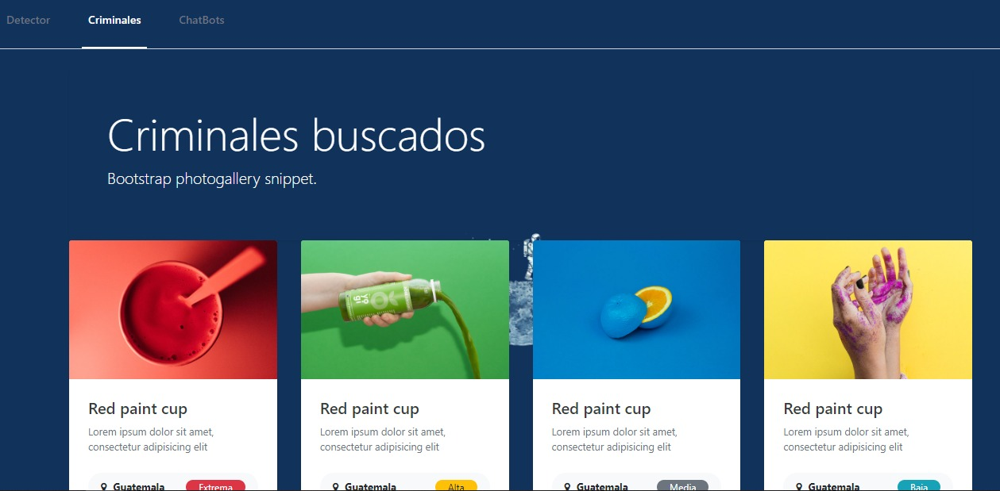
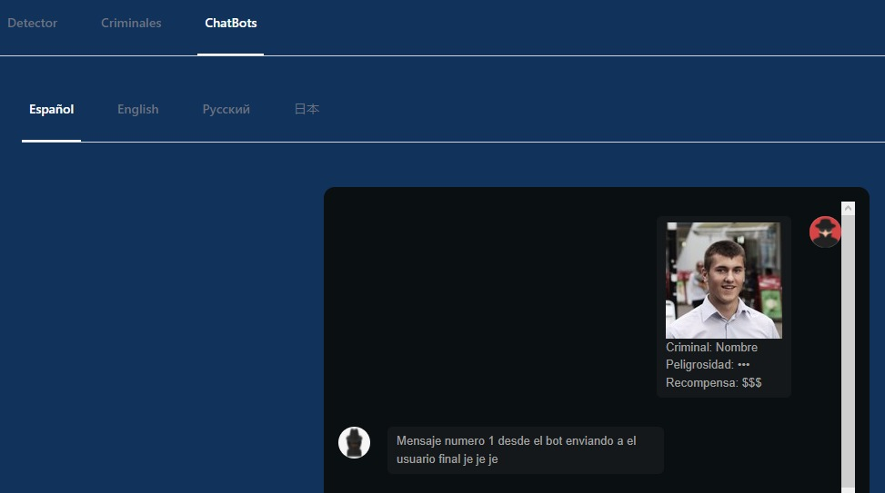

# MANUAL DE USUARIO
## Objetivos del manual
- Conocer el uso de Wante[D]etector.
- Utilizar de manera correcta la aplicacion y sacarle el maximo provecho.
- Administrar el registro de criminales.
- Entender el uso del chatbot
## Descripcion 
Wante[D]etector es una app que permite buscar personas a tiempo real a partir de reconocimiento facial y mostrar porque delitos se busca a esa pesona y sus rasgos con la opcion de traducir este mensaje a diferentes idiomas. Tambien cuenta con un asistente virtual con el que podemos interactuar en caso de encontrar un criminal y obtener nuestra recompensa o pasos a seguir dependiendo de cuantas estrellas tenga el criminal o si desea reportar algun crimen anonimamente. La aplicacion cuenta con dos paginas, la primera que sera para el administrador en donde se pueden gestionar los criminales, sus descripciones, recompensas, peligrosidad y cara, y la otra que es donde se pueden ver estos registros guardados.
## Uso de aplicacion
### Pantalla inicial - Web Privada

Pantalla inicial de la web privada donde el administrador debera ingresar sus credenciales para acceder.
### Registrar criminal

Esta pantalla permite subir la informacion de un criminal como su nombre, grado de peligrosidad, recompensa, delito y donde fue visto la ultima vez. Tambien permite subir la fotografia del criminal.
### Registro de criminales

Tabla que muestra todos los criminales con su informacion ingresados a la aplicacion.
### Pantalla inicial - Web Publica

En esta web no existe un loggin el acceso es libre

El detector de criminales permite colocar la fotografia del criminal a ingresar

Fichas de cada criminal

Chatbot para saber las pistas y recompensas

