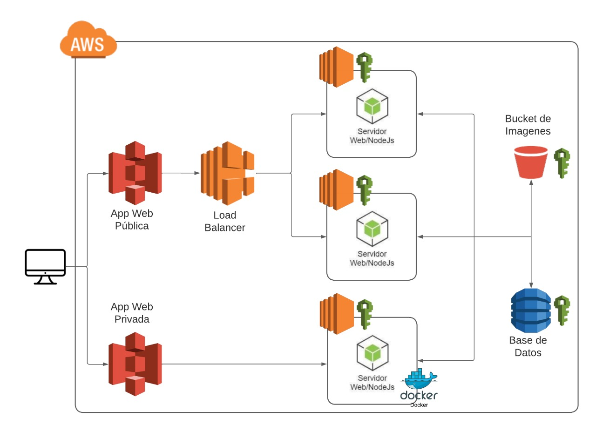
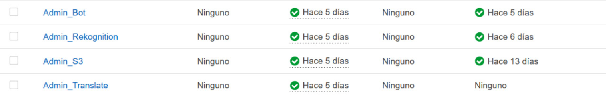
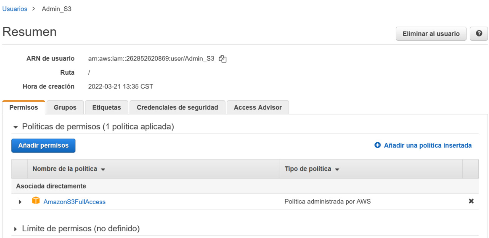
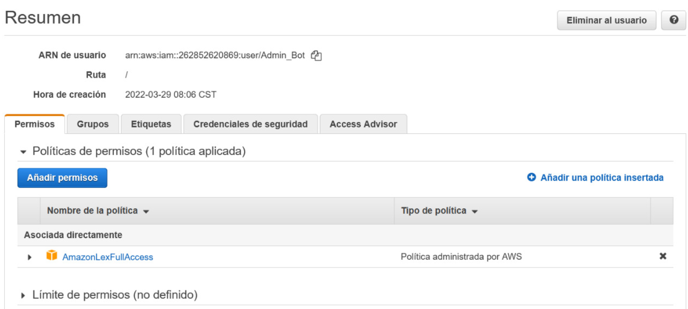
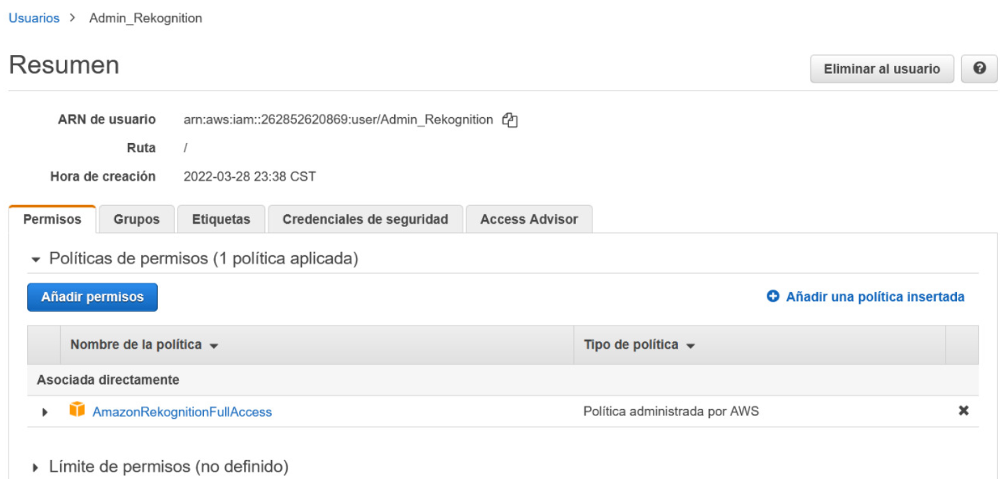
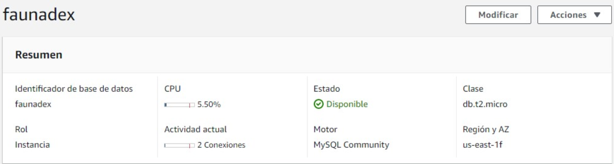
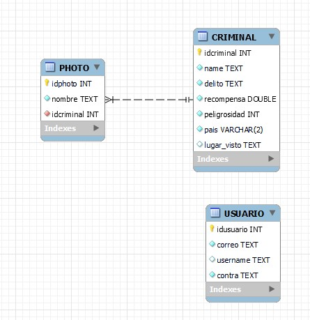

# MANUAL TECNICO 
## Objetivos del proyecto
- Desarollar una aplicacion que permita la busqueda y registro de criminales.
- Aplicar los conocimientos adquiridos en la clase magistral y laboratorio.
- Crear una aplicación innovadora utilizando servicios de la nube.
- Aplicar las tecnologias de la nube en un entorno real.

## Descripcion del proyecto
Wante[D]etector es una app que permite buscar personas a tiempo real a partir de reconocimiento facial y mostrar porque delitos se busca a esa pesona y sus rasgos con la opcion de traducir este mensaje a diferentes idiomas. Tambien cuenta con un asistente virtual con el que podemos interactuar en caso de encontrar un criminal y obtener nuestra recompensa o pasos a seguir dependiendo de cuantas estrellas tenga el criminal o si desea reportar algun crimen anonimamente.
La aplicacion cuenta con dos paginas, la primera que sera para el administrador en donde se pueden gestionar los criminales, sus descripciones, recompensas, peligrosidad y cara, y la otra que es donde se pueden ver estos registros guardados.

## Arquitectura implementada

## Presupuesto del proyecto 
### EC2
La capa gratuita de AWS incluye 750 horas de instancias t2.micro de Linux y Windows, (t3.micro para las regiones en las que t2.micro no está disponible) cada mes durante un año. 

### RDS
Como parte del nivel gratuito de AWS, Amazon RDS ayuda a los nuevos clientes de AWS a comenzar de forma gratuita con un servicio de base de datos administrada en la nube. Cada mes natural, el nivel gratuito de Amazon RDS le permite utilizar:
- 750 horas de uso de instancias db.t2.micro, db.t3.micro y db.t4g.micro Amazon RDS Single-AZ que ejecutan las bases de datos de MySQL, MariaDB, PostgreSQL cada mes. Si ejecuta más de una instancia, se suma el uso entre las clases de instancias.
- 20 GB de almacenamiento de bases de datos de uso general (SSD).
- 20 GB de almacenamiento para sus copias de seguridad de base de datos automatizadas y cualquier instantánea de base de datos iniciada por el usuario.
### S3 
Como parte del nivel gratuito de AWS, puede comenzar a utilizar Amazon S3 sin cargo. Al registrarse, los clientes nuevos de AWS reciben 5 GB de almacenamiento de Amazon S3 en la clase de almacenamiento S3 Standard, 20 000 solicitudes GET, 2000 solicitudes PUT, COPY, POST o LIST y 100 GB de transferencia de datos de salida al mes.
### Balanceador de carga
Elastic Load Balancing de forma gratuita con el nivel gratuito de AWS. Al registrarse, los nuevos clientes de AWS reciben 750 horas al mes compartidas entre los balanceadores de carga clásicos y de aplicaciones; 15 GB de procesamiento de datos para los balanceadores de carga clásicos y 15 LCU para los balanceadores de carga de aplicaciones.
## Servicios utilizados
- EC2: Es una parte central de la plataforma de cómputo en la nube de la empresa Amazon.com denominada Amazon Web Services (AWS). EC2 permite a los usuarios alquilar computadores virtuales en los cuales pueden ejecutar sus propias aplicaciones. 
- RDS: Amazon Relational Database Service es un servicio de base de datos relacional distribuida de Amazon Web Services. Es un servicio web que se ejecuta "en la nube" diseñado para simplificar la configuración, el funcionamiento y el escalado de una base de datos relacional para su uso en aplicaciones.
- S3: Es un servicio ofrecido por Amazon Web Services que proporciona almacenamiento de objetos a través de una interfaz de servicio web. Amazon S3 utiliza la misma infraestructura de almacenamiento escalable que utiliza Amazon.com para ejecutar su red de comercio electrónico.
- IAM: AWS Identity and Access Management (IAM) es un servicio web que lo ayuda a controlar de forma segura el acceso a los recursos de AWS. Utilice IAM; para controlar quién está autenticado (ha iniciado sesión) y autorizado (tiene permisos) para utilizar recursos.
- Rekognition: Amazon Rekognition facilita la incorporación del análisis de imagen y vídeo a sus aplicaciones. Proporcione una imagen o un vídeo a la API de Amazon Rekognition y el servicio podrá identificar objetos, personas, texto, escenas y actividades. Asimismo, puede detectar cualquier contenido inadecuado. Amazon Rekognition proporciona además funcionalidades de análisis, comparación y búsqueda de rostros altamente precisas. Puede detectar, analizar y comparar rostros para una amplia variedad de casos de uso, como la verificación de usuarios, catalogación, contabilización de personas y seguridad pública.

# AWS Services
Para el desarrollo del proyecto se diseño una arquitectura AWS completamente en la nube compuesta por:
* Un sitio web alojado en Amazon S3
* Un balanceador configurado en balanceadores carga de EC2
* Dos servidores alojados en dos instancias de EC2 para el backend 
  * Un servidor aloja una api REST desarrollada en nodejs
  * Un servidor aloja una api REST desarrollada en python
* Almacenamiento de información utilizando RDS y DBMS MySQL
* Almacenamiento de imagenes a través un bucket en Amazon S3
**USUARIOS IAM**

Se creo un usuario Admin_S3 con permisos "AmazonS3FullAccess" para todo el manejo de S3

Se creo un usuario Admin_Bot con permisos "AmazonLexFullAccess" para todo el manejo de los bot

Se creo un usuario Admin_Rekognition con permisos "AmazonRekognitionFullAccess" para todo el manejo de análisis de imágenes

**INSTANCIA RDS**

**ER**

